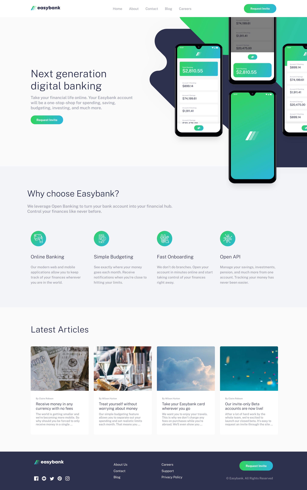

# Frontend Mentor - Easybank landing page solution

This is a solution to the [Easybank landing page challenge on Frontend Mentor](https://www.frontendmentor.io/challenges/easybank-landing-page-WaUhkoDN). Frontend Mentor challenges help you improve your coding skills by building realistic projects. 

## Table of contents

- [Overview](#overview)
  - [The challenge](#the-challenge)
  - [Screenshot](#screenshot)
  - [Links](#links)
- [My process](#my-process)
  - [Built with](#built-with)
  - [What I learned](#what-i-learned)
  - [Continued development](#continued-development)
- [Author](#author)

## Overview

### The challenge

Users should be able to:

- View the optimal layout for the site depending on their device's screen size
- See hover states for all interactive elements on the page

### Screenshot



### Links

- [Solution URL](https://www.frontendmentor.io/solutions/easybank-landing-page-using-react-scss-and-mobilefirst-workflow--AIOhxE7Z)
- [Live Site URL](https://easybank-landing-page-nkhatri7.netlify.app/)

## My process

### Built with

- Mobile-first workflow
- [React](https://reactjs.org/) - JS library
- SCSS
- Flexbox

### What I learned

This was my first time working with React functional components in a project so I learnt how to use `useState`, `useEffect`, and `useRef`. Below are examples of these features in my code:
```js
const [mobileMenu, setMobileMenu] = useState(false);
const menuToggle = useRef(null);
const nav = useRef(null);
const overlay = useRef(null);

const handleMenuToggle = () => {
  setMobileMenu(current => !current);
}

useEffect(() => {
    if (mobileMenu) {
        menuToggle.current.classList.add('hamburger-clicked');
        nav.current.classList.add('mobile-nav-open');
        overlay.current.classList.add('overlay-active');
    } else {
        menuToggle.current.classList.remove('hamburger-clicked');
        nav.current.classList.remove('mobile-nav-open');
        overlay.current.classList.remove('overlay-active');
    }
});
```

It was also my first time using SCSS, I found this really helpful as it cuts down a lot of lines for styling and makes writing the styles really efficient. I really like how you can nest the classes and also the pseudo elements, and also using mixins and using them in other files. Below is an example of how I used all these features in my code:
```scss
$gradient: linear-gradient(to right, $limegreen, $brightcyan);

@mixin flex-center {
    display: flex;
    flex-direction: column;
    justify-content: center;
    align-items: center;
}

> .logo-socials {
        @include flex-center;
        > .social-icons {
            margin-top: 2rem;
            > .social-link {
                &:not(:last-child) {
                    margin-right: 1rem;
                }
            }
        }
    }
```

### Continued development

I want to keep developing my React skills and continue completing the intermediate level challenges. I will move onto the advanced challenges soon.

## Author

- Frontend Mentor - [@nkhatri7](https://www.frontendmentor.io/profile/nkhatri7)
- LinkedIn - [Neil Khatri](https://www.linkedin.com/in/neilkhatri/)
